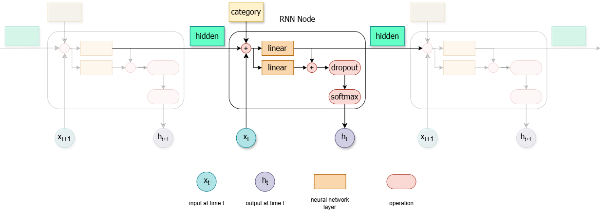
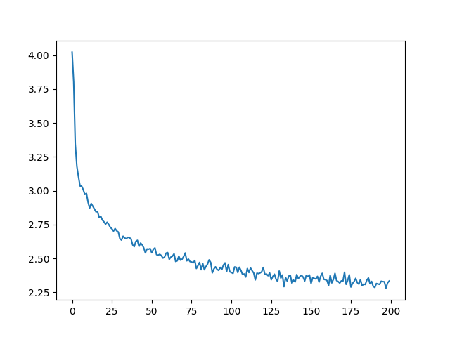

# RNN-Name-Generation

Generation of name based on a country input.

## Network Architecture



## Train
Loss per training iteration (100K)





## Eval
```python
py eval.py
```
Example eval:
```
Vietnamese names:
Van
Na
Man

German names:
Geren
Eren
Ronger

Japanese names:
Jaka
Pana
Naka

Chinese names:
Cha
Han
Iun 
```

## Reference 
- [Instruction](https://pytorch.org/tutorials/intermediate/char_rnn_generation_tutorial.html#Creating-the-Network)